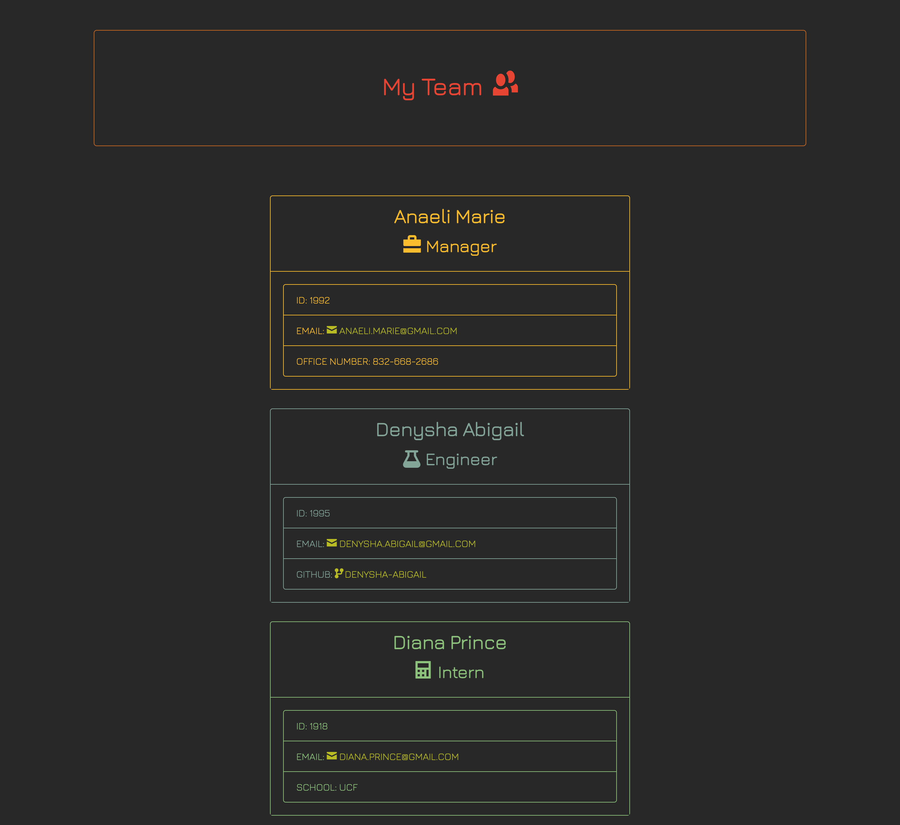

# generateTeam();

[](https://opensource.org/licenses/MIT)

## Description:
This back-end command-line server-side interface application utilizes JavaScript, Node.js, and Node Package Manager (npm) to prompt users to input information about the members of their team before generating an HTML and CSS file that will display a visual representation of their responses on a front-end client-side interface.

## Table of Contents
  - [Installation](#installation)
  - [Usage](#usage)
  - [Preview](#preview)
  - [Test](#test)
  - [License](#license)
  - [Contribution](#contribution)
  - [Questions](#questions)
  - [Credits](#credits)

## Installation:
- To install, clone this repository onto your local computer, open it in your code editor, and run the following command on your terminal:
```npm install```

## Usage:
- Once all packages have been installed, run the command ```npm run start``` or ```node index.js``` on your terminal and answer the displayed prompts as they appear on your command-line interface. Upon completion, a message will appear below the last prompt indicating that the application successfully created the HTML and CSS file! In order to access the files, make sure you navigate to and open the dist folder. The HTML file is now ready to be viewed on your browser!

https://user-images.githubusercontent.com/96617237/166179085-695290b5-be3e-47c7-8d61-6b03e18c3506.mp4

## Preview:


## Test:
- All test suites and tests should pass when you run the following command on your terminal:
```npm run test```

## License:
- This project is licensed under: [MIT](https://opensource.org/licenses/MIT)

## Contribution:
- Forking this repository is always welcomed and encouraged!

> If you encounter a problem with this application, please add an issue or pull request to the GitHub repository. 

## Questions:
- Please feel free to use this application at any time and visit my personal [GitHub](https://github.com/denysha-abigail) profile to access other open source projects! 

## Credits:
- *[Denysha Guerrios-Armaiz](https://github.com/denysha-abigail), 05/2022*
